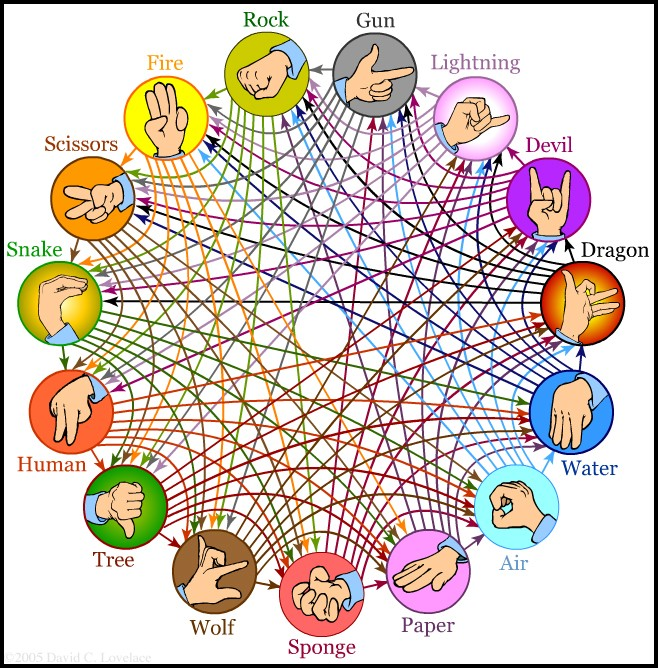

# Rock, Paper, Scissor's + (*rps*)
> *RPS game that I created during my 100 Days of Code challenge*

![Python version][python-version]
[![GitHub issues][issues-image]][issues-url]
[![GitHub forks][fork-image]][fork-url]
[![GitHub Stars][stars-image]][stars-url]
[![License][license-image]][license-url]

NOTE: This app was generated with [Cookiecutter](https://github.com/audreyr/cookiecutter) along with [@clamytoe's](https://github.com/clamytoe) [toepack](https://github.com/clamytoe/toepack) project template.

The task was to create a rock paper scissors game but beefed up with this setup:



I coded this to work on a Linux system, so your mileage may vary. Once I had the initial text version working how I 
liked it, I thought that it I thought that it would be a good exercise to try and display the "rolls" in play. Inspired 
by [pybites](https://pybit.es/) [Using Pillow to Create Nice Banners For Your Site](https://pybit.es/pillow-banner-image.html) article, I
decided to try and do the same.

After extracting all of the *rolls* with [GIMP](https://www.gimp.org/) I decided to kick it up a notch and create a
sprite sheet out of them with [TexturePacker](https://www.codeandweb.com/texturepacker):


Still not satisfied with all of that, I kicked it up and notch by super imposing a red X over the losing play!


Even with all f that, it's still pretty clunky. I should have just used [PyGame](https://www.pygame.org/) but I had 
already spent enough time on this. I basically wanted to prove to myself that I could do it.


### Initial setup
```bash
cd Projects
git clone https://github.com/clamytoe/rps.git
cd rps
```

#### Anaconda setup
If you are an Anaconda user, this command will get you up to speed with the base installation.
```bash
conda env create
conda activate rps
```

#### Regular Python setup
If you are just using normal Python, this will get you ready, but I highly recommend that you do this in a virtual environment. There are many ways to do this, the simplest using *venv*.
```bash
python3 -m venv venv
source venv/bin/activate
pip install -r requirements.txt
```

#### Final setup
```bash
pip install -e .
```

## Usage
```bash
rps
```

## Contributing
Contributions are very welcome. Tests can be run with with `pytest -v`, please ensure that all tests are passing and that you've checked your code with the following packages before submitting a pull request:
* black
* isort
* pycodestyle
* pylint
* pytest-cov

I am not adhering to them strictly, but try to clean up what's reasonable.

## License
Distributed under the terms of the [MIT](https://opensource.org/licenses/MIT) license, "rps" is free and open source software.

## Issues
If you encounter any problems, please [file an issue](https://github.com/clamytoe/toepack/issues) along with a detailed description.

## Changelog
* **v0.1.0** Initial commit.

[python-version]:https://img.shields.io/badge/python-3.6.6-brightgreen.svg
[issues-image]:https://img.shields.io/github/issues/clamytoe/rps.svg
[issues-url]:https://github.com/clamytoe/rps/issues
[fork-image]:https://img.shields.io/github/forks/clamytoe/rps.svg
[fork-url]:https://github.com/clamytoe/rps/network
[stars-image]:https://img.shields.io/github/stars/clamytoe/rps.svg
[stars-url]:https://github.com/clamytoe/rps/stargazers
[license-image]:https://img.shields.io/github/license/clamytoe/rps.svg
[license-url]:https://github.com/clamytoe/rps/blob/master/LICENSE
